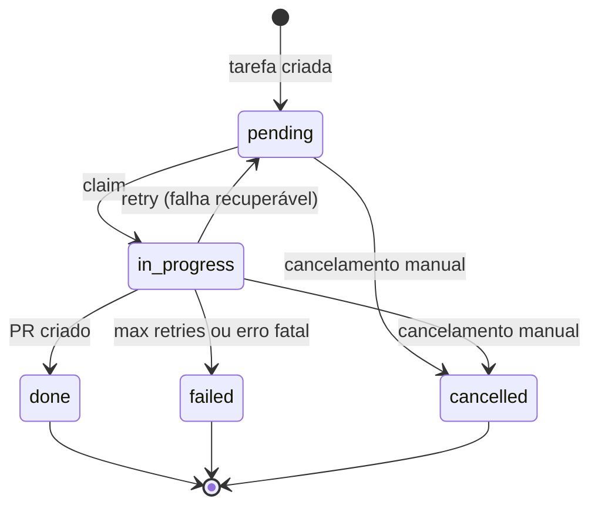

# Especificações — Agente autônomo (orchestrator-ai)

Documento de referência para implementação do orquestrador de tarefas com agente Cursor, Supabase e fluxo Git/PR.

---

## 1. Visão geral

### 1.1 Objetivo

Permitir que o sistema identifique **novas tarefas** armazenadas no Supabase, execute o trabalho no repositório de código (a partir da branch `develop`) e abra um **Pull Request** ao concluir, com rastreabilidade de status e links.

### 1.2 Princípio arquitetural

Não existe um único agente “mágico”. O sistema é composto por:

| Componente | Responsabilidade |
|------------|------------------|
| **Supabase** | Fila de tarefas, status, metadados (PR, branch, run do agente) |
| **Orquestrador (worker)** | Claim de tarefas, Git determinístico, disparo do agente, abertura de PR |
| **Cursor SDK (agente)** | Implementação no código (edição, testes, commits) |
| **MCP Supabase** | Contexto de banco durante a execução do agente (consulta/atualização de tarefas) |
| **Git + GitHub CLI (`gh`)** | Branches, push e criação de PR |

### 1.3 Escopo fora deste documento

- Branching do **banco** Supabase (`create_branch` do MCP) — não substitui branch Git.
- Substituição de revisão humana em PRs (recomendado manter review obrigatório).
- Integração com Linear/Jira (fase futura opcional).
- Múltiplos repositórios, organizações e credenciais por cliente (fase 2).

### 1.4 Escopo MVP — um único repositório

O MVP opera sobre **um repo fixo**, configurado no orquestrador (não na tarefa):

| Config (`.env`) | Exemplo | Uso |
|-----------------|---------|-----|
| `TARGET_REPO` | `minha-org/meu-app` | PR e contexto no prompt |
| `REPO_PATH` | `/var/repos/meu-app` | Clone local onde o Git e a IA trabalham |
| `BRANCH_BASE` | `develop` | Base de todas as branches e PRs |

Implicações:

- A tabela `tasks` **não** precisa de coluna `repository` no MVP.
- Toda tarefa usa o mesmo clone; o worker valida `REPO_PATH` na subida.
- Um `GITHUB_TOKEN` (ou `gh` já autenticado) com acesso a esse repo é suficiente.
- Org GitHub: desde que o token tenha acesso ao repo `org/repo`, não é necessário multi-tenant no código.

Fluxo inalterado: tarefa no banco → claim → `develop` → branch → IA → push → PR → `develop`.

Regras obrigatórias (produção proibida, fluxo Git/PR fixo): **[REGRAS-DESENVOLVIMENTO.md](./REGRAS-DESENVOLVIMENTO.md)**.

---

## 2. Requisitos funcionais

### RF-01 — Registro de tarefas

O sistema deve permitir criar tarefas com, no mínimo:

- Título, descrição (escopo) e **critérios de aceite** (campo `acceptance_criteria` ou seção na `description`).
- Status do ciclo de vida.
- Metadados opcionais: prioridade, labels, repositório alvo, branch base (padrão: `develop`).

### RF-02 — Detecção de tarefas novas

O orquestrador deve processar tarefas com status `pending`. Mecanismos aceitos (implementar pelo menos um na v1):

1. **Polling** — intervalo configurável (ex.: 30–60 s).
2. **Webhook** — Supabase Database Webhook ou Edge Function que notifica o worker (fase 1.1).

### RF-03 — Claim atômico

Ao iniciar o processamento, uma única instância do worker deve marcar a tarefa como `in_progress` de forma atômica (evitar processamento duplicado).

### RF-04 — Fluxo Git

Para cada tarefa em processamento:

1. `git fetch origin`
2. `git checkout develop`
3. `git pull origin develop`
4. Criar branch: `agent/task-{id}` ou `agent/{slug}-{id}` (configurável)
5. Após o agente concluir com sucesso: `git push -u origin <branch>`

O orquestrador executa os passos 1–4 **antes** de invocar o agente; o push pode ser do agente ou do orquestrador (definir na implementação — recomendado: agente commita, orquestrador faz push e PR).

### RF-05 — Execução pelo agente Cursor

O worker invoca o Cursor SDK com:

- Prompt estruturado contendo ID da tarefa, título, descrição, branch atual e convenções do repositório.
- Acesso ao repositório (`local.cwd` ou `cloud.repos`).
- MCP Supabase configurado para leitura/atualização da linha da tarefa (status, notas).

O agente deve:

- Implementar a tarefa conforme descrição.
- Executar testes/lint quando existirem no projeto.
- Criar um ou mais commits com mensagens descritivas.
- Não fazer push nem abrir PR diretamente (responsabilidade do orquestrador na v1), salvo se optar por `auto_create_pr` no runtime cloud com regras explícitas.

### RF-06 — Abertura de Pull Request

Após push bem-sucedido:

- Base: `develop` (ou `branch_base` da tarefa).
- Head: branch criada no RF-04.
- Ferramenta: `gh pr create` com título e corpo derivados da tarefa.
- Persistir `pr_url` e número do PR na tarefa.

### RF-07 — Finalização e falha

| Resultado | Status final | Campos atualizados |
|-----------|--------------|-------------------|
| Sucesso | `done` | `pr_url`, `branch_name`, `agent_run_id`, `completed_at` |
| Falha recuperável | `pending` ou `failed` | `error_message`, `retry_count` |
| Falha definitiva | `failed` | `error_message`, `failed_at` |

Política de retry (v1): até **2** tentativas com backoff; após isso, `failed`.

### RF-08 — Idempotência

Se a tarefa já possui `pr_url` e status `done`, o worker não deve reprocessar.

Se status é `in_progress` há mais de **N** minutos (stale lock, padrão 120), permitir reclaim para `pending` ou marcar `failed` conforme configuração.

### RF-09 — Concorrência

v1: **uma tarefa por vez** por worker (`MAX_CONCURRENT_TASKS=1`).

Fase futura: fila com limite configurável e lock por `repository_id`.

### RF-10 — Observabilidade

Registrar em cada transição:

- `agent_run_id` (Cursor)
- Timestamps: `started_at`, `completed_at`, `failed_at`
- Mensagem de erro truncada (ex.: 2000 caracteres)

Logs estruturados no worker (JSON): `task_id`, `event`, `duration_ms`.

---

## 3. Requisitos não funcionais

### RNF-01 — Segurança

- Chaves apenas no orquestrador (variáveis de ambiente / secrets manager):
  - `CURSOR_API_KEY`
  - `SUPABASE_URL`, `SUPABASE_SERVICE_ROLE_KEY` (worker; nunca no frontend)
  - `GITHUB_TOKEN` ou credencial usada pelo `gh`
- RLS na tabela `tasks`: leitura/escrita pública negada; service role no worker; políticas opcionais para dashboard autenticado.
- Não commitar segredos; validar `.env` no `.gitignore`.

### RNF-02 — Confiabilidade

- Distinguir falha de **startup** do SDK (`CursorAgentError`) de falha de **run** (`status === "error"`).
- Sempre chamar `run.wait()` e descartar o agente (`await using` / `with`).
- Respeitar `isRetryable` / `retry_after` do SDK em retries de infraestrutura.

### RNF-03 — Performance e custo

- Timeout máximo por tarefa (sugestão: 45–90 min, configurável).
- Modelo padrão do agente: `composer-2.5` (ou listar via `Cursor.models.list`).

### RNF-04 — Manutenibilidade

- Código modular: módulos separados para `supabase`, `git`, `cursor`, `pr`, `worker`.
- Sem comentários no código de produção; nomes descritivos em camelCase.
- Documentação de operação neste arquivo e em `README.md` (quando existir).

---

## 4. Modelo de dados (Supabase)

### 4.1 Enum `task_status`

```
pending | in_progress | done | failed | cancelled
```

### 4.2 Tabela `tasks`

| Coluna | Tipo | Obrigatório | Descrição |
|--------|------|-------------|-----------|
| `id` | `uuid` | sim | PK, default `gen_random_uuid()` |
| `title` | `text` | sim | Título curto |
| `description` | `text` | sim | Escopo do que implementar |
| `acceptance_criteria` | `text` | sim | Critérios de aceite (vão no prompt e no corpo do PR) |
| `status` | `task_status` | sim | Default `pending` |
| `priority` | `smallint` | não | Maior = mais urgente; default 0 |
| `branch_base` | `text` | não | Ignorado no MVP se `BRANCH_BASE` estiver no env; útil na fase multi-repo |
| `branch_name` | `text` | não | Preenchido ao criar branch |
| `pr_url` | `text` | não | URL do PR no GitHub |
| `pr_number` | `integer` | não | Número do PR |
| `agent_run_id` | `text` | não | ID do run Cursor |
| `agent_agent_id` | `text` | não | ID do agente Cursor |
| `error_message` | `text` | não | Último erro |
| `retry_count` | `smallint` | sim | Default 0 |
| `claimed_by` | `text` | não | Identificador da instância do worker |
| `claimed_at` | `timestamptz` | não | Início do claim |
| `started_at` | `timestamptz` | não | Início da execução do agente |
| `completed_at` | `timestamptz` | não | Conclusão com sucesso |
| `failed_at` | `timestamptz` | não | Falha definitiva |
| `created_at` | `timestamptz` | sim | Default `now()` |
| `updated_at` | `timestamptz` | sim | Trigger `updated_at` |

### 4.3 Índices

- `(status, created_at)` onde `status = 'pending'` — fila.
- `(status, claimed_at)` — detecção de stale `in_progress`.

### 4.4 SQL de claim (referência)

```sql
UPDATE tasks
SET
  status = 'in_progress',
  claimed_by = $1,
  claimed_at = now(),
  updated_at = now()
WHERE id = (
  SELECT id FROM tasks
  WHERE status = 'pending'
  ORDER BY priority DESC, created_at ASC
  LIMIT 1
  FOR UPDATE SKIP LOCKED
)
RETURNING *;
```

### 4.5 RLS (v1)

- Habilitar RLS em `tasks`.
- Política para `service_role`: acesso total (implícito com service key no worker).
- Política opcional para usuários autenticados: `SELECT` apenas das próprias tarefas (se houver `created_by` em fase futura).

---

## 5. Orquestrador (worker)

### 5.1 Stack (MVP)

- **Framework:** NestJS
- **Fila:** BullMQ + Redis (`@nestjs/bullmq`)
- **Agendamento:** `@nestjs/schedule` (poll de tarefas `pending`)
- **Runtime:** Node.js 20+
- **SDK IA:** `@cursor/sdk` (adapter Claude Code em fase posterior)
- **Supabase:** `@supabase/supabase-js`
- **Git/PR:** CLI `git` e `gh` no PATH (via `child_process` / `execa`)

### 5.2 Variáveis de ambiente

| Variável | Obrigatória | Descrição |
|----------|-------------|-----------|
| `CURSOR_API_KEY` | sim | API key Cursor |
| `SUPABASE_URL` | sim | URL do projeto |
| `SUPABASE_SERVICE_ROLE_KEY` | sim | Service role (apenas worker) |
| `TARGET_REPO` | sim | `owner/repo` do único repo do MVP |
| `REPO_PATH` | sim | Caminho absoluto do clone local |
| `BRANCH_BASE` | não | Default `develop` |
| `REDIS_URL` | sim | Conexão BullMQ (ex.: `redis://localhost:6379`) |
| `GITHUB_TOKEN` | sim | Token para `gh` |
| `POLL_INTERVAL_MS` | não | Default `60000` |
| `TASK_TIMEOUT_MS` | não | Default `5400000` (90 min) |
| `STALE_LOCK_MINUTES` | não | Default `120` |
| `MAX_RETRIES` | não | Default `2` |
| `BRANCH_PREFIX` | não | Default `agent/task` |
| `CURSOR_MODEL` | não | Default `composer-2.5` |
| `CURSOR_RUNTIME` | não | `local` \| `cloud` |
| `WORKER_ID` | não | Hostname ou UUID da instância |

### 5.3 Loop principal (pseudocódigo)

```
loop:
  task = claimNextTask(workerId)
  if !task: sleep(POLL_INTERVAL_MS); continue

  try:
    if task.pr_url: markDone(); continue

    prepareGit(task)           // develop + branch
    run = invokeCursorAgent(task)
    await run.wait()
    if run.status == 'error': throw

    gitPush(task.branch_name)
    pr = createPullRequest(task)
    markTaskDone(task, pr)
  catch err:
    handleFailure(task, err)
```

### 5.4 Módulos previstos

```
src/
  worker/          # loop e claim
  supabase/        # cliente e queries
  git/             # checkout, branch, push
  cursor/          # Agent.create, prompt, MCP
  github/          # gh pr create
  config/          # env e validação
```

---

## 6. Agente Cursor

### 6.1 Runtime

| Modo | Quando usar |
|------|-------------|
| **local** | Servidor/CI com clone do repo; MCP stdio no mesmo host |
| **cloud** | Sem runner fixo; VM Cursor clona o repo; opcional `auto_create_pr` |

Definir explicitamente `local` ou `cloud` na configuração — não depender do default implícito.

### 6.2 MCP Supabase

- Transporte: HTTP (recomendado em cloud) ou stdio (local com Supabase MCP instalado).
- Escopo mínimo do agente: `execute_sql` para ler/atualizar a linha da tarefa atual.
- Credenciais via headers/env no MCP; nunca no prompt.

### 6.3 Template de prompt (estrutura)

```
Você está executando a tarefa {taskId} no repositório {repo}.

Branch atual (não renomeie): {branchName}
Base: {branchBase}

## Título
{title}

## Descrição e critérios de aceite
{description}

## Regras
- Trabalhe apenas nesta branch.
- Siga os padrões existentes no repositório.
- Rode testes/lint do projeto antes de finalizar.
- Faça commits atômicos com mensagens claras em português ou inglês (conforme o repo).
- Não abra PR nem faça push (o orquestrador fará isso).
- Ao terminar, atualize a tarefa no Supabase com nota breve no campo apropriado (se aplicável).

## MCP
Use o MCP Supabase para consultar a tarefa id = {taskId} se precisar de contexto adicional.
```

### 6.4 Pós-condições esperadas do agente

- Working tree com commits à frente de `develop` na branch da tarefa.
- Sem arquivos de segredo adicionados.
- Testes críticos passando (quando existirem).

---

## 7. Integração GitHub

### 7.1 Pré-requisitos

- `gh auth login` ou `GH_TOKEN` com escopo `repo`.
- Branch protection em `develop`: PR obrigatório (compatível com o fluxo).

### 7.2 Formato do PR

- **Título:** `[orchestrator-ai] {title} (#{taskId})`
- **Corpo:** descrição da tarefa + link para registro no Supabase (se houver UI) + checklist de aceite copiado da tarefa.

### 7.3 Cloud SDK (opcional)

Se `CURSOR_RUNTIME=cloud`:

- `cloud.repos`: repositório alvo.
- `auto_create_pr`: apenas se o orquestrador **não** usar `gh` (escolher um caminho na v1 para evitar PR duplicado).
- `skip_reviewer_request: true` em CI/automação.

---

## 8. Fluxo de estados



---

## 9. Casos de borda

| Caso | Comportamento |
|------|----------------|
| `develop` com conflito no pull | Falha com mensagem; retry após intervenção ou merge manual |
| Agente sem commits | Marcar `failed`; não abrir PR |
| Push rejeitado (branch exists) | Verificar se PR já existe; idempotência |
| Timeout do agente | Cancelar run se suportado; `failed` ou retry |
| `TARGET_REPO` ou `REPO_PATH` ausente no env | Worker não inicia (validação no bootstrap) |
| Migrações DDL na tarefa | v1: **não** automatizar; exigir label `requires-human` (fase futura) |

---

## 10. Fases de entrega

Backlog detalhado (IDs, dependências, critérios): **[TAREFAS.md](./TAREFAS.md)**.

### Fase 1 — MVP (um repo)

- [ ] Épicos 0–11 em [TAREFAS.md](./TAREFAS.md)

### Fase 1.1

- [ ] Webhook Supabase → worker
- [ ] Stale lock reclaim
- [ ] Métricas básicas (contagem por status)

### Fase 2

- [ ] Coluna `repository` e multi-repo / multi-org
- [ ] Runtime cloud opcional
- [ ] Dashboard (leitura de tarefas)
- [ ] Integração issue tracker
- [ ] Concorrência > 1 com locks por repo

---

## 11. Critérios de aceite do projeto orchestrator-ai

1. Inserir linha em `tasks` com status `pending` dispara processamento automático em até `POLL_INTERVAL_MS`.
2. Ao concluir, existe PR aberto contra `develop` e `pr_url` preenchido.
3. Não há processamento duplicado da mesma tarefa com dois workers (claim `SKIP LOCKED`).
4. Falhas registram `error_message` e respeitam `MAX_RETRIES`.
5. Segredos não aparecem em logs nem no repositório.

---

## 12. Decisões

| # | Decisão | MVP |
|---|---------|-----|
| D1 | Stack do orquestrador | **NestJS + BullMQ + Redis** |
| D2 | Repositórios | **Um único repo** (`TARGET_REPO` + `REPO_PATH`) |
| D3 | Runtime IA v1 | **local** (recomendado) / cloud |
| D4 | Motor IA v1 | **Cursor SDK** / Claude Code depois |
| D5 | Quem faz `git push` | **orquestrador** (agente só commita) |
| D6 | MCP Supabase no agente | **não** no MVP |
| D7 | Entrada de tarefas | apenas tabela `tasks` (poll) |

Preencher antes do scaffold: valor de `TARGET_REPO`, caminho `REPO_PATH`, URLs/keys Supabase.

---

## 13. Referências

- [Cursor SDK — TypeScript](https://cursor.com/docs/sdk/typescript)
- [Cursor SDK — Python](https://cursor.com/docs/sdk/python)
- [Cursor MCP](https://cursor.com/docs/mcp)
- [Supabase — Database Webhooks](https://supabase.com/docs/guides/database/webhooks)
- [GitHub CLI — pr create](https://cli.github.com/manual/gh_pr_create)

---

*Versão do documento: 1.1 — MVP: repositório único, NestJS + BullMQ.*
